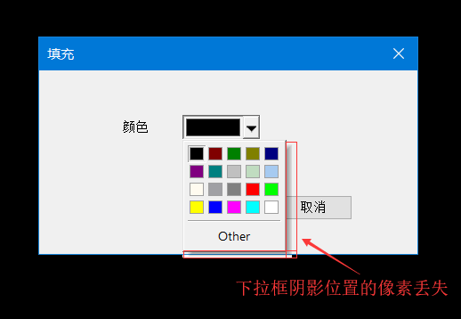
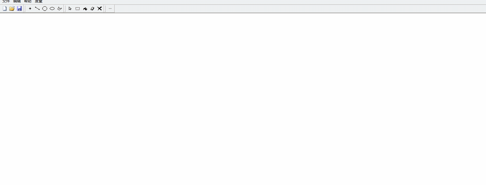
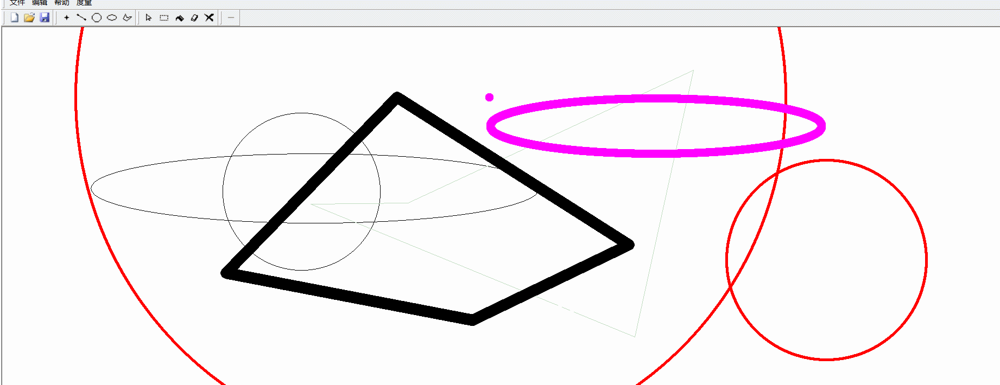
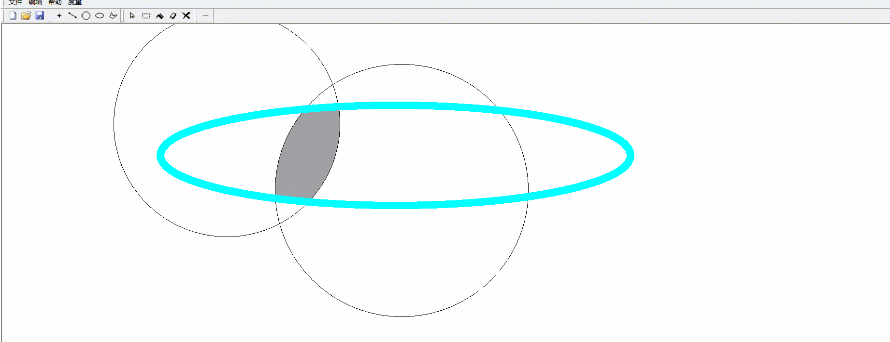
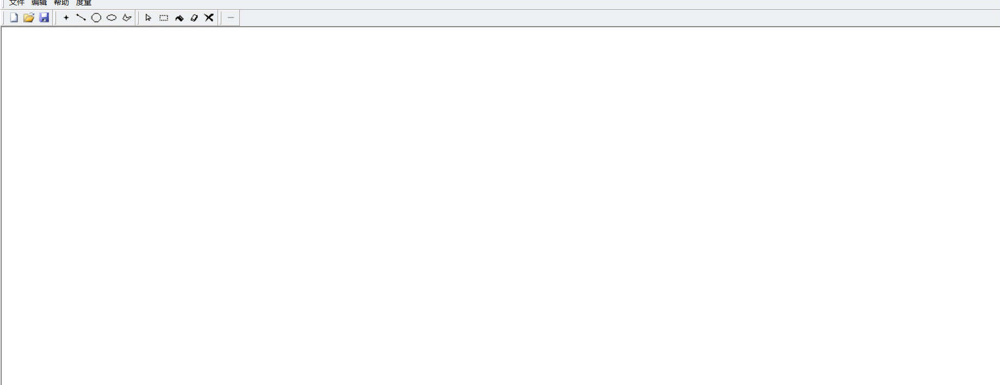

# MFC简单绘图程序（类似于Windows的画图软件）

~~我知道MFC已经是过时技术了，但是老师上课要求没办法o(�i�n�i)o~~

基于C++、MFC单文档编程；

仓库中不包含编译结果；

## 功能列表

1. 绘制点，并控制点的尺寸、颜色；
2. 绘制直线，并控制线宽、线颜色；
3. 绘制正圆，并控制线宽、线颜色；
4. 绘制椭圆（任意圆），并控制线宽、线颜色；
5. 绘制多边形，并控制线宽、线颜色；
6. 封闭图形填充，并控制填充颜色；
7. 矩形可变区域裁剪，并支持移动；
8. 文件内容加载和持久化存储（bmp位图）；
9. 其他：橡皮擦、清空画布；

## 已知BUG

1. 裁剪功能不够完善（各种BUG）；
2. 使用对话框中选择颜色的CMFCColorButton时，如果点击了右侧的下拉三角形，绘制下拉菜单时会使下拉菜单阴影处“_|”形的像素丢失，而且不会自动刷新（见下二图）；

## 演示图片（选取几张，所有图片在`show`目录下，这些图片不一定是最新版本的效果！）

