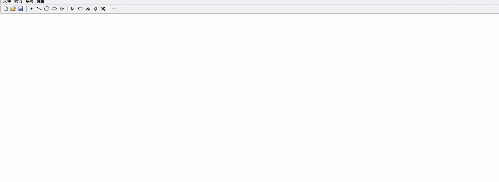
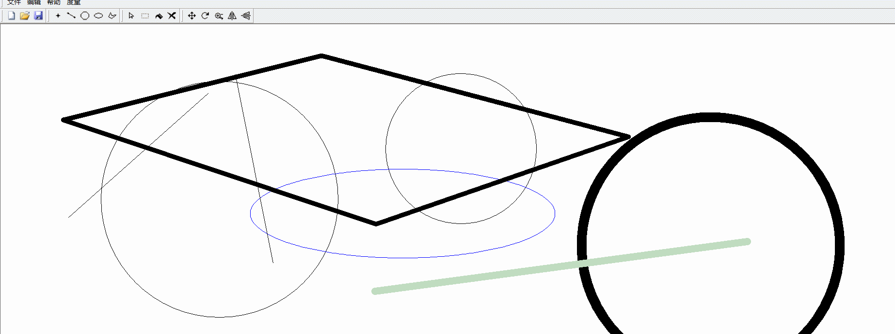
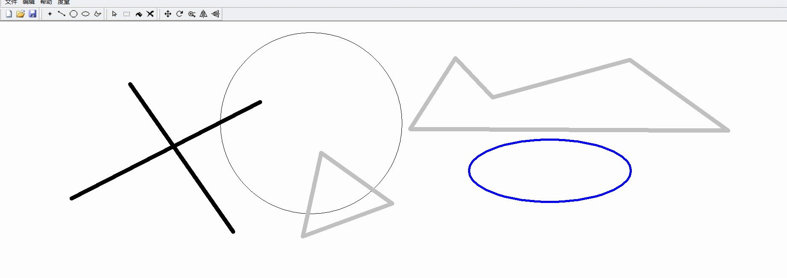
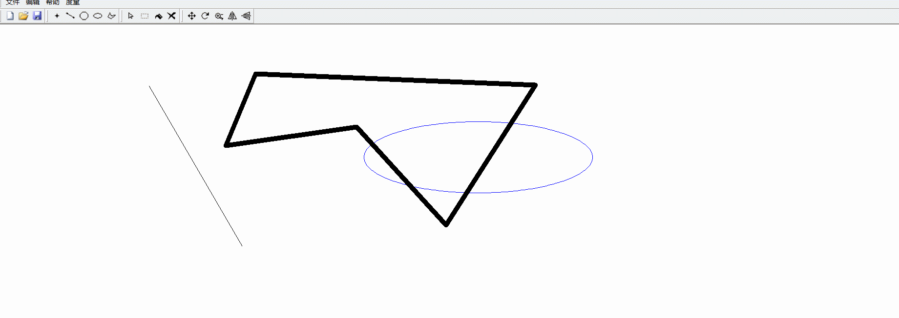
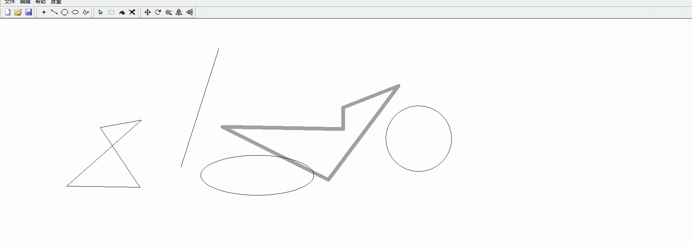
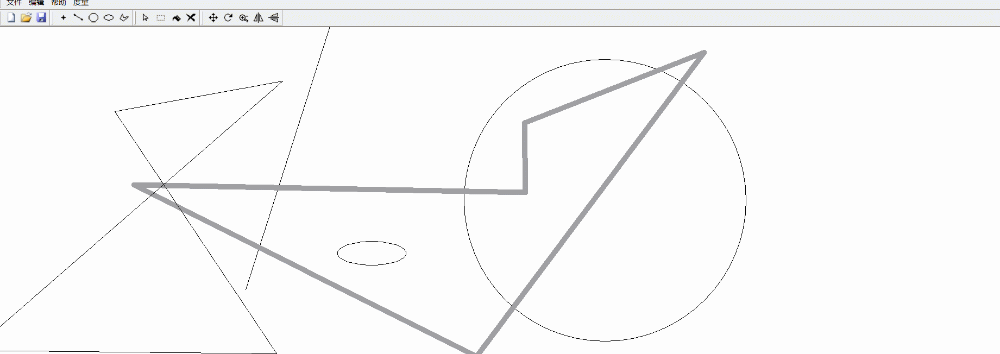

# MFC简单绘图程序

基于C++、MFC单文档编程；

仓库中不包含编译结果；

## 功能列表

1. 绘制点，并控制点的种类、尺寸、颜色；
2. 绘制直线，并控制线宽、线颜色；
3. 绘制正圆，并控制线宽、线颜色；
4. 绘制椭圆（任意圆），并控制线宽、线颜色；
5. 绘制多边形，并控制线宽、线颜色；
6. 填充封闭图形，并控制填充颜色；
7. 单独选中图形，进行平移、旋转、缩放、对称变换；
8. 绘制图形和图形变换时，显示中间过程的“橡皮筋”效果；
9. 文件内容加载和持久化存储（bmp位图）；
10. 其他：工具栏按钮、清空画布；

## 已知BUG

1. 只记录填充位置，窗口大小改变时会导致填充错位。

## 演示图片（选取几张，所有图片在`show`目录下，这些图片不一定是最新版本的效果！）

