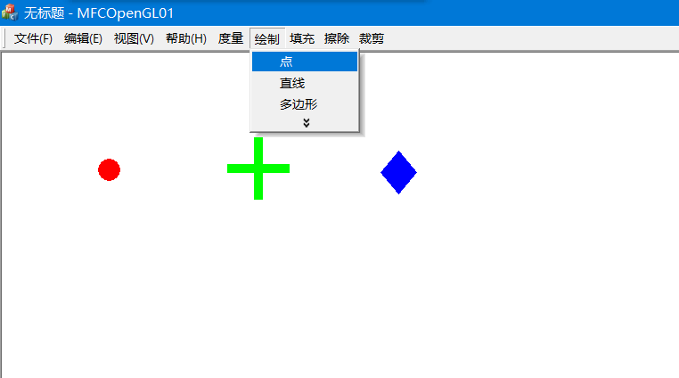
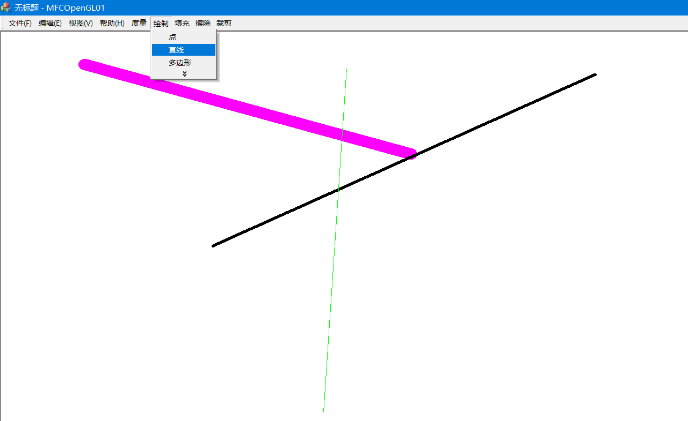
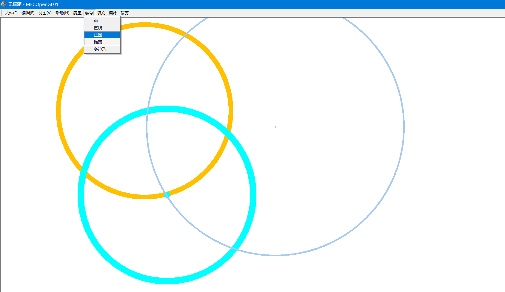
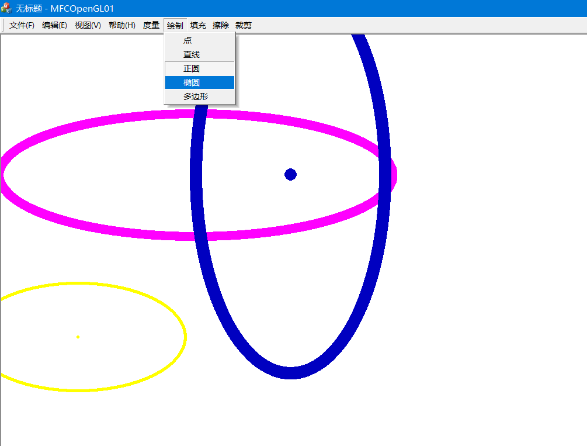
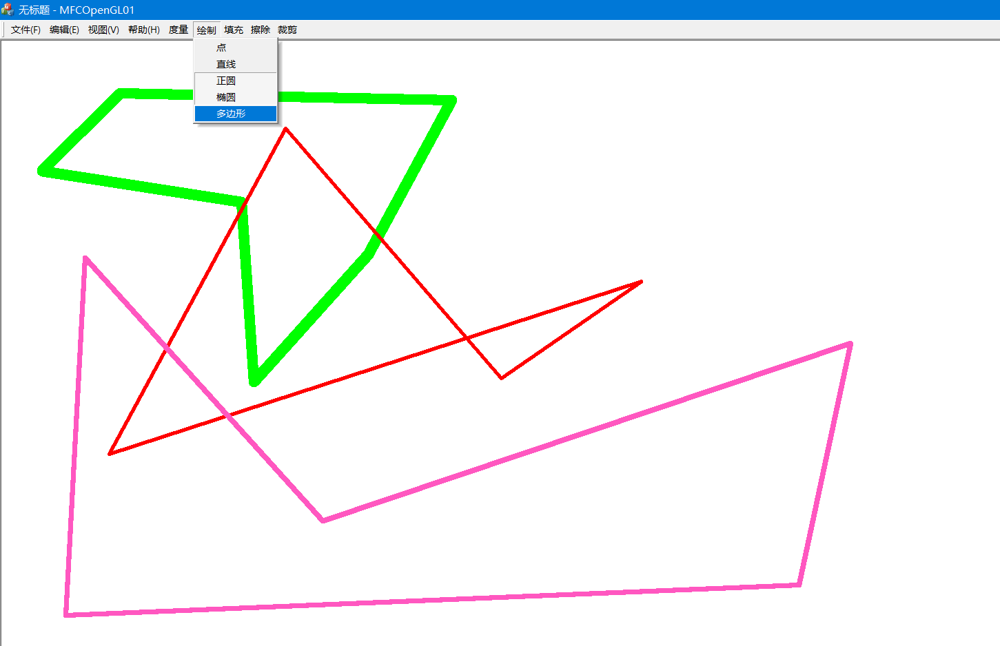
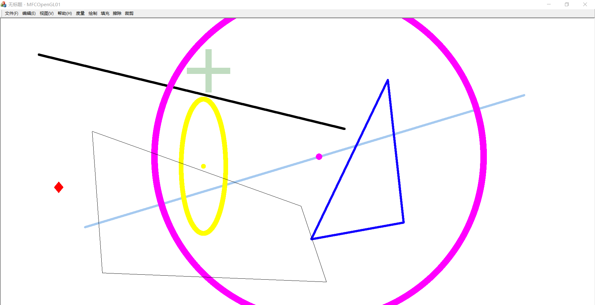
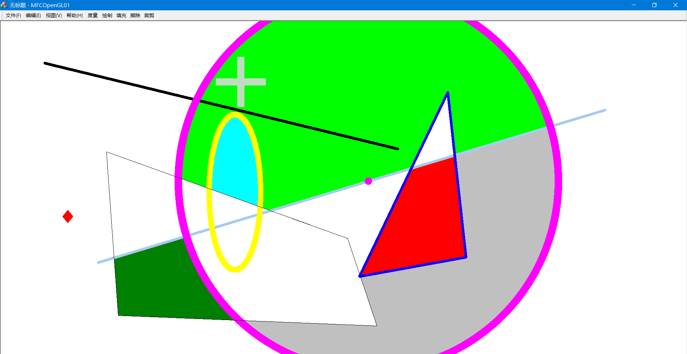
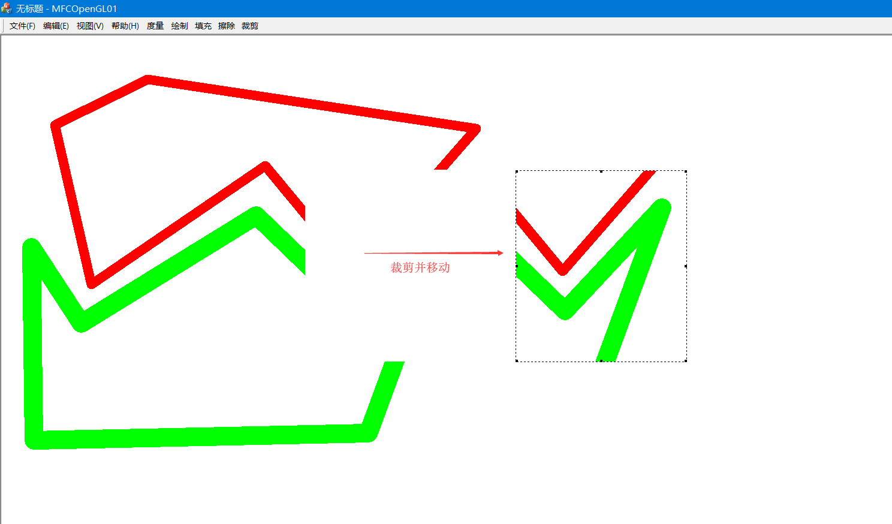
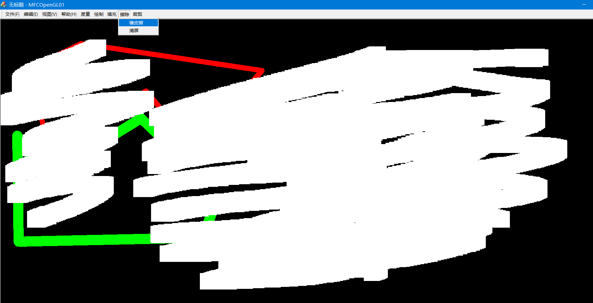
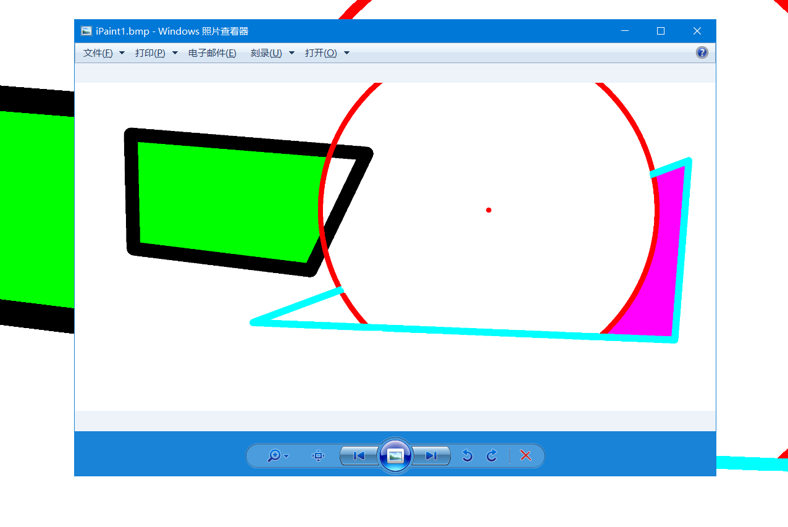

# MFC简单绘图程序（类似于Windows的画图软件）

~~我知道MFC已经是过时技术了，但是老师上课要求没办法o(�i�n�i)o~~

基于C++、MFC单文档编程；

仓库中不包含编译结果；

## 功能列表

1. 绘制点，并控制点的尺寸、颜色
2. 绘制直线，并控制线宽、线颜色
3. 绘制正圆，并控制线宽、线颜色
4. 绘制椭圆，并控制线宽、线颜色
5. 绘制多边形，并控制线宽、线颜色
6. 封闭图形填充，并控制填充颜色
7. 矩形可变区域裁剪，并支持移动
8. 文件内容加载和持久化存储（bmp位图）
9. 其他：橡皮擦、清空画布

## 演示图片（选取几张，所有图片在`show`目录下）

